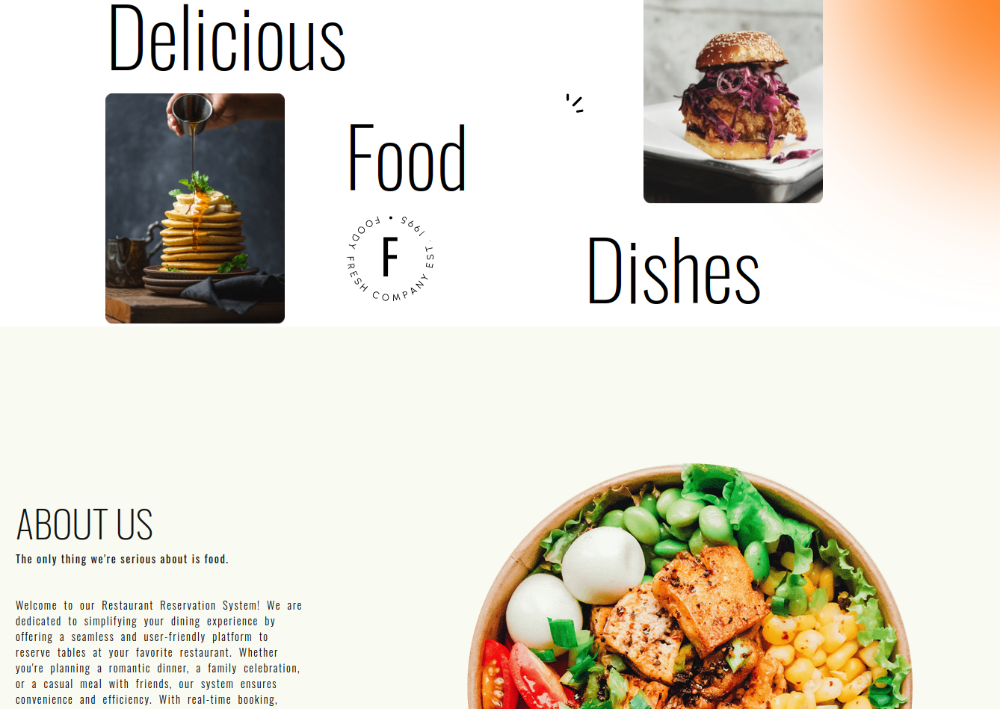

# 🍽️ Food Reservation System

A full-stack food reservation system built using modern web technologies, enabling users to browse restaurants, explore menus, and reserve tables in real time with a seamless and responsive experience.

---

## 🚀 Features

- 🔐 User Authentication (Login / Signup)
- 🍴 Browse restaurants and menus
- 📅 Table reservation system
- 📋 Booking management
- ⚡ Fast and responsive UI
- 🔄 Real-time availability updates

---

## 🛠️ Tech Stack

### Frontend:
- React.js
- Tailwind CSS

### Backend:
- Node.js
- Express.js

### Database:
- MongoDB

---

## 📸 Screenshots



---

## ⚙️ Installation

```bash
git clone https://github.com/SYEDMDSAAD/RestBackend.git
cd food-reservation-system
```
## 🔧 Backend Setup

```bash
cd backend
npm install
npm start
```

## 🎨 Frontend Setup

Frontend Link: https://github.com/SYEDMDSAAD/RestFrontend

---

## 🌐 Live Demo
https://rest-frontend-b3wu.vercel.app/

---

## 📂 Backend Structure

```bash
backend
├── config
│   └── config.env
│
├── controller
│   └── reservation.js
│
├── database
│   └── dbConnection.js
│
├── error
│   └── error.js
│
├── models
│   └── reservationSchema.js
│
├── routes
│   └── reservationRoute.js
│
├── .gitignore
├── app.js
├── server.js
├── vercel.json
├── package-lock.json
└── package.json
```
---

## 🤝 Contributing

Contributions are welcome! Feel free to open issues or submit pull requests.
⭐ If you like this project, give it a star!
